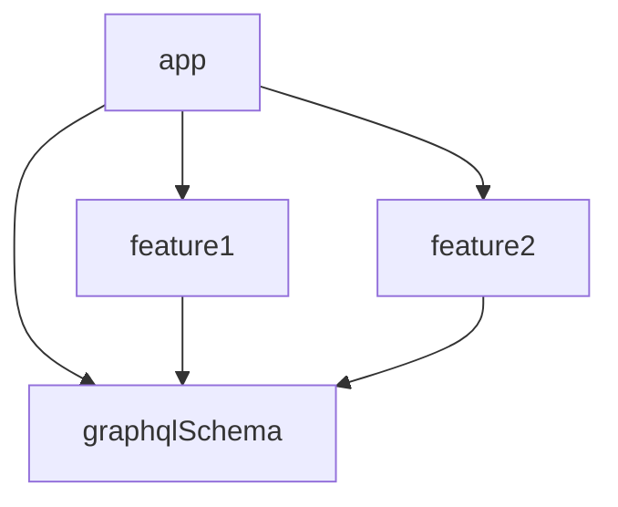

# Multi modules and services project with Apollo Kotlin 3 sample

This is a minimalist sample of a project with several modules and services
using [Apollo Kotlin 3](https://www.apollographql.com/docs/kotlin).

It contains 3 modules:

- `graphqlSchema`
  - Contains the GraphQL schema for 2 services
  - Defines 1 query for each service
- `feature1`
  - Depends on `graphqlSchema`
  - Defines 1 additional query for each service
- `feature2`
  - Depends on `graphqlSchema`
  - Defines 1 additional query for each service
- `app`
  - Depends on `graphqlSchema`, `feature1` and `feature2`
  